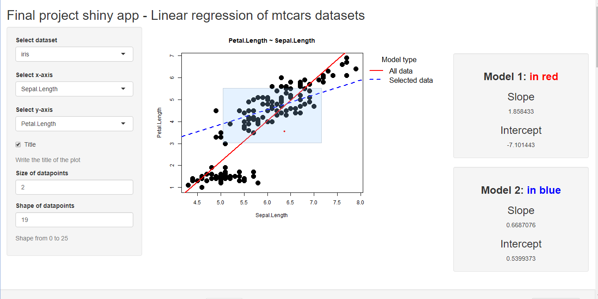

## Introduction

This presentation is part of the Developing Data Products Coursera.org course project submission.

It is an R Presentation generated with RStudio.

### Application Overview

- The application is written in Shiny which is a web application framework for R
- The source code consists of two files: server.R and ui.R
- server.R includes the the server logic of a Shiny web application
- ui.R includes the the user-interface definition, which uses the sidebarLayout template

## How it works? - I | The Application contains: Left Panel

- Label the main titel using a textInput
- Change/determine the size of the plot points using a numericInput
- Add a line of best fit using a checkboxInput
- Select data options using selectInput
- The app compare the models when choosing all data points against one selecting only part of it.

## How it works? - II | The Application contains: Main Panel

There are two sections in main panel as below:

- Plot region: This displays plot for corresponding dataframe
- Model results section: This displays model result of the choosed dataframe and compare

## Ready to give it a try?

Use the Shiny app at https://beta.rstudioconnect.com/connect/#/apps/16d99bb1-f2d5-4842-98c5-07a0cd629538/access

The Shiny app source code is available at
https://github.com/Ibrahimhassan94/DSS-JHU/tree/main/Devoloping%20data%20products/week%204%20project/final-project-shinyapp
